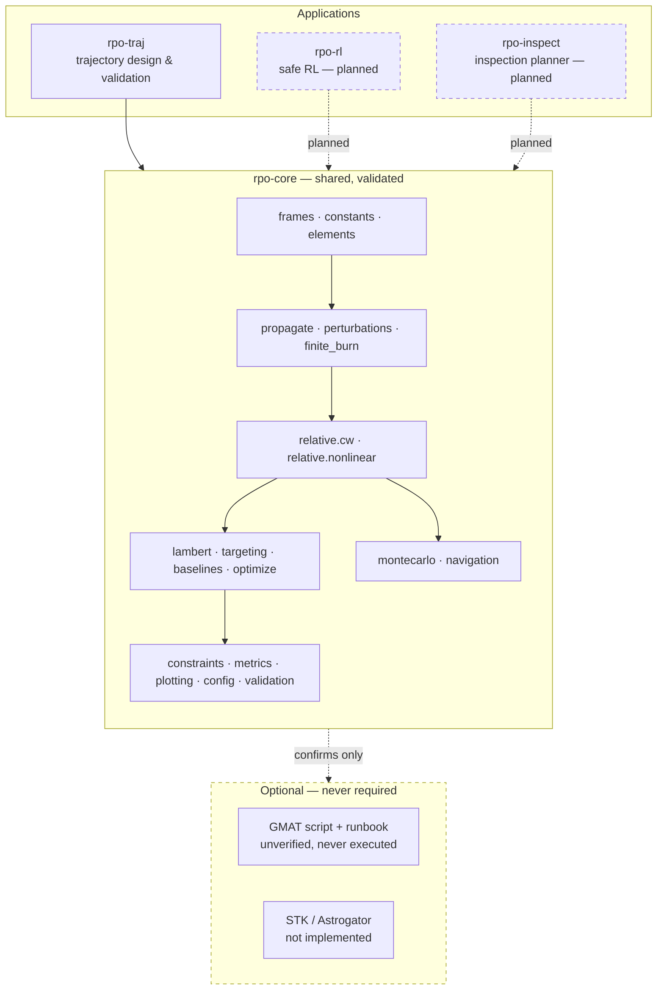

# rpo-suite

Rendezvous and proximity operations: trajectory design, safe reinforcement learning, and
payload inspection planning. A validated astrodynamics core with applications built on top.

> **This is educational simulation software, not flight software.** It is not verified to
> DO-178C, NPR 7150.2 or ECSS. See [DISCLAIMER.md](DISCLAIMER.md).

```bash
uv sync --extra viz
uv run pytest -q
uv run rpo-traj plan configs/vbar_baseline.yaml --seed 42
```

No STK, no GMAT, no network. Every number below reproduces from a clean clone with
`uv run --extra viz python scripts/generate_results.py`.

---

## The organising principle

Every model is measured against something that did not produce it.

| Model | Its independent oracle | Measured agreement |
|---|---|---|
| Two-body propagator | analytic Kepler / Lagrange f–g | **8.4e-05 m** over 15.5 orbits |
| Clohessy-Wiltshire | nonlinear differenced orbits | error law below |
| Lambert solver | the validated propagator | **7.1e-04 m** propagate-back |
| J2 secular rates | closed-form `Ω̇`, sun-sync inclination | **0.13 %** |
| Linear covariance | Monte Carlo sample covariance | converges in the small-dispersion limit |

A test that compares code against its own past output cannot detect an error that was present
from the start. So the suite asserts closed-form solutions, conservation laws, and limiting
cases instead.

## Headline result: the CW error law, measured then derived

Clohessy-Wiltshire is a linearisation. How wrong is it? Measured against nonlinear two-body
motion with an exactly circular target — isolating linearisation error from eccentricity error:

```
err(one orbit) = 6π · ρ² / r
```

Reproducible to six significant figures across 400/800/1500 km altitudes and 1 km/10 km
separations. It was then **derived**, not left as a fit:

A chaser at a pure along-track Hill offset *at rest in the Hill frame* is not co-orbital. Its
position offset raises `|r|` by `ρ²/2r`; rigid co-rotation adds a radial velocity `nρ`. Each
contributes `n²ρ²/2` to specific energy, so `Δa = 2ρ²/r`. The classical secular drift
`Δy = −3π·Δa` per revolution then gives `−6π·ρ²/r` exactly.

| ρ | measured error | `6πρ²/r` | measured `Δa` | `2ρ²/r` |
|---:|---:|---:|---:|---:|
| 1 km | 2.7728 m | 2.7728 m | 0.29420 m | 0.29420 m |
| 5 km | 69.319 m | 69.319 m | 7.3550 m | 7.3550 m |
| 10 km | 277.28 m | 277.28 m | 29.4199 m | 29.4198 m |

The coefficient is structural, not fitted. Full derivation: [docs/cw_validity.md](docs/cw_validity.md).

## Baselines, scored identically

```
Method                       Burns     Total dv          TOF    Term. pos    Term. vel     Model
                                          (m/s)   (orbits)        err (m)    err (m/s)   premise
------------------------------------------------------------------------------------------------
Hohmann phasing                  4     0.275042      4.000      2.252e+01    4.971e-02     VALID
Lambert direct                   2     6.176503      0.400      4.451e-06    4.338e-09     VALID
CW two-impulse                   2     6.168171      0.400      7.339e+01    6.975e-02   INVALID
CW + nonlinear correction        2     6.176503      0.400      2.520e-04    5.158e-13   INVALID
```

Terminal errors are evaluated under **nonlinear** dynamics for every method — scoring a model
under the model that produced it would flatter it.

The `INVALID` flags are the point. At 10 km separation CW's own linearisation bound is 166 m
against a 5 m budget, 33× over. Rank this table by Δv alone and you would recommend a method
operating outside its own envelope. **There is deliberately no "best" column.** At 250 m
separation both CW rows report VALID.

## Differential correction

CW-planned burns do not arrive where they were aimed under real dynamics. Shooting-method
correction onto nonlinear dynamics, terminal miss for a half-period V-bar hop:

| Separation | Raw CW | Corrected |
|---:|---:|---:|
| 100 m | 1.225e-02 m | 1.41e-08 m |
| 1 km | 1.225e+00 m | 5.52e-07 m |
| 10 km | 1.225e+02 m | 7.48e-04 m |

The raw miss scales as ρ² to four figures — the same `6πρ²/r` law reappearing, unprompted, in a
different problem.

## What the baseline scenario actually shows

The shipped scenario **violates its own approach corridor, deliberately.** A half-period
two-impulse V-bar hop bulges radially by exactly `Δy/4` — 187.5 m here, reaching 20.56° against
a 10° corridor. That is geometry, independent of altitude and transfer time, not a tuning error.
The CLI reports it and exits 1. A baseline that fails a constraint honestly is a legitimate
baseline; Phase B multi-burn work is what fixes it.

Under 1000 dispersed runs (seed 42): keep-out-zone breach probability **0.214, Wilson 95 %
[0.190, 0.240]**, zero outright failures.

**Navigation error dominates delivery dispersion by orders of magnitude.** Terminal error is
`−Φ` applied to the *estimation* error, so a 5 m delivery dispersion the filter can see costs
6.4e-11 m. But at τ = π the coefficient `Φ_rv[1,1] = −3π/n = −8367 s` turns **1 mm/s of velocity
knowledge error into 8.4 m of along-track miss** — 17 % of the margin between the arrival hold
point and the keep-out sphere. On this mission you buy safety with a better filter, not a better
thruster.

## Architecture



The optional layer **confirms** results; it never produces them. Every number in this README is
reproducible without a licence.

## Status

| Package | State |
|---|---|
| `rpo-core` | 26 modules — frames, propagation, relative motion, targeting, Lambert, perturbations, finite burns, constraints, uncertainty, metrics, validation |
| `rpo-traj` | Flagship 1 complete through Phase C: CLI, dispersed campaigns, baseline comparison |
| `rpo-rl` | not started |
| `rpo-inspect` | not started |

Requirements: **38 MET / 4 PARTIAL / 12 OPEN** — see [docs/project1/srs.md](docs/project1/srs.md).
1,663 fast tests in 40 s; `ruff`, `ruff format` and `mypy --strict` clean.

## What this project does not do

- **No STK, Astrogator or PySTK code exists here** — not stubbed, not sketched. Requirements
  F-6.1…F-6.4 are `[OPEN]`, not met. Writing code against an API that could not be executed
  would be fabrication.
- **GMAT was never run.** The mission script and runbook are written and marked unverified; the
  comparison harness is tested against an analytic Kepler oracle instead.
- **The inertial frame is GCRF-approximated.** Precession, nutation and polar motion are
  neglected, costing ≈9.5 m/day in LEO — **1.1e+05 times larger than the integrator error**. Any
  cross-tool disagreement beyond a few hours measures that, not the dynamics.
  See [docs/frames.md](docs/frames.md).
- Constraint values are publicly documented, order-of-magnitude representative figures. They are
  not the requirements of any real programme.

## Documentation

[Conventions](docs/conventions.md) · [Engineering standard](docs/CONTRIBUTING.md) ·
[CW validity](docs/cw_validity.md) · [Frames](docs/frames.md) ·
[SRS](docs/project1/srs.md) · [Math model](docs/project1/math-model.md) ·
[Technical write-up](docs/project1/write-up.md) · [Engineering review](docs/project1/eng-review.md) ·
[Backlog](docs/project1/backlog.md)

## License

Apache-2.0 (code), CC-BY-4.0 (documentation and figures).
