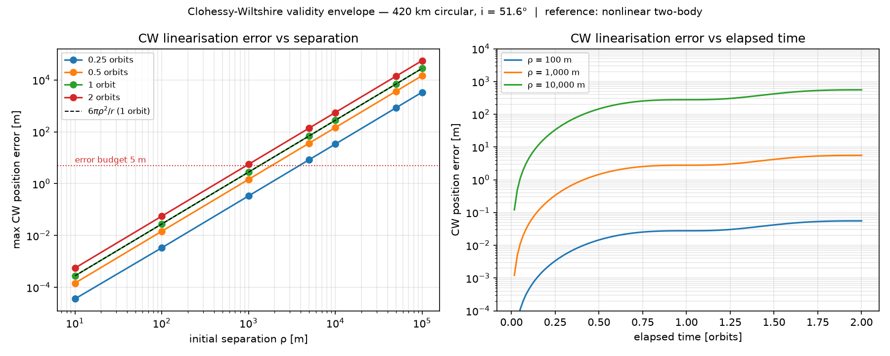

# rpo-suite

Rendezvous and proximity operations: trajectory design, safe reinforcement learning, and
payload inspection planning. A shared astrodynamics core with three applications built on
top of it.

> **This is educational simulation software, not flight software.** See
> [DISCLAIMER.md](DISCLAIMER.md) for model limitations and responsible-use scope.

## Status

| Package | What it is | State |
|---------|-----------|-------|
| `rpo-core` | Shared core: frames, propagators, relative motion, constraints, Monte Carlo, metrics | **Slices 1-2 complete** — Hill frame, CW targeting, two-body propagation, measured CW validity envelope |
| `rpo-traj` | Flagship 1: RPO trajectory design and validation | not started |
| `rpo-rl` | Flagship 2: safe RL for autonomous rendezvous | not started |
| `rpo-inspect` | Flagship 3: payload inspection mission planner | not started |

## Quickstart

```bash
uv sync --extra viz
uv run pytest -q
```

`--extra viz` installs matplotlib, which only the plotting layer needs. Plain `uv sync` also
works — the plotting tests then skip rather than run, and everything else is unaffected. The
numerics core deliberately never imports matplotlib, so a headless Monte Carlo campaign pulls
no plotting stack.

No STK, no GMAT, no network access required. That is deliberate: the optional validation
layer confirms results, it never produces them.

## Reference scenario

An ISS-like low Earth orbit, used consistently across all three applications.

| Parameter | Value |
|-----------|-------|
| Altitude | 420 km circular |
| Inclination | 51.6° |
| Semi-major axis | 6 798 137 m |
| Mean motion | 1.1264 × 10⁻³ rad/s |
| Orbital period | 5 578 s (93.0 min) |

## Conventions

Units are SI and carried in variable names. The Hill frame is `x` radial-outward (R-bar),
`y` along-track (V-bar), `z` the **positive** orbit normal. Full details, including the
transport-theorem requirement and the numerical tolerance policy, in
[docs/conventions.md](docs/conventions.md).

## Measured result: the CW validity envelope

The linear relative-motion model is not trusted on assertion. Its error against nonlinear
two-body motion is measured, and the one-orbit position error obeys

```
err = 6π · ρ² / r
```

to six significant figures across 400/800/1500 km altitudes and 1 km/10 km separations.
With an error budget of 1 % of the 200 m keep-out sphere, CW is trustworthy out to
**≈850 m separation over one orbit**; the MVP baseline hop incurs ≈1.5 m. Details and the
reproduction command in [docs/cw_validity.md](docs/cw_validity.md).



## What Slices 1-2 establish

The Clohessy-Wiltshire state transition matrix and the two-impulse targeting solve, with a
test suite built from **limiting cases and closed-form solutions** rather than stored
output of this same code:

- drift-free condition `ẏ₀ = −2n·x₀` produces a closed relative orbit
- a radial impulse traces a closed 2:1 ellipse returning to the origin after one period
- the closed-form STM agrees with independent numerical integration of `ẋ = Ax`
- a half-period V-bar hop matches the analytic result `Δv₁ = Δv₂ = n·Δy/4`
- singular and infeasible transfer times raise typed errors instead of returning garbage
- two-body propagation conserves energy and angular momentum to < 1e-10 relative over ten
  orbits, and converges monotonically as integrator tolerance tightens
- CW is validated against an **external oracle** (nonlinear two-body differencing), not
  only against closed-form properties of itself

## License

Apache-2.0 (code). Documentation and figures CC-BY-4.0.
